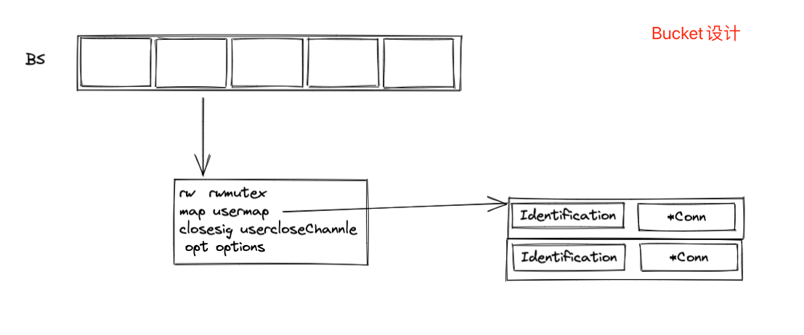
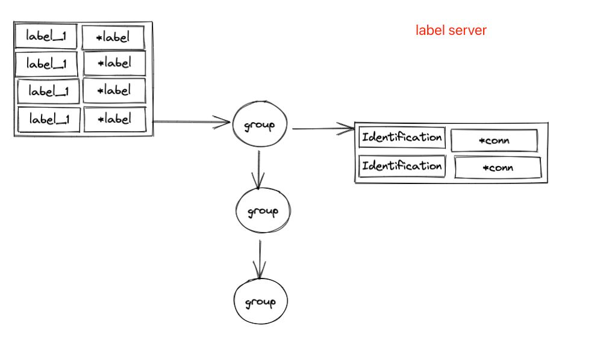

# SIM
对sim的思考，之前开源过一个项目是im，在我的github主页还能看到，其实长链接项目无非是两套重逻辑，一套是基于tcp的长链接
或者是基于websocket的长链接，本质都是连接，但是websocket可以直接利用http+tls的便车，所以如果自己实现一套tcp的长
连接其实不是特别有必要的话，我是不建议的。但是可以从网络库的角度来切入，比如原生包的net实现是BIO，也就是阻塞等待IO，那么
我们可以切换另外一套net库实现我们的底层接入逻辑，比如说基于NIO的非阻塞等待IO，目前开源的gnet、netpoll都是不错的选择，
后面为了练手也好，解耦也好，我还是有打算写一套自己的netpoll，名称叫snetpoll。

## 目录
- [整体设计](##整体设计)
  - [用户连接存放](####用户连接存放)
  - [label设计](####label设计)
- [快速开始](##快速开始)
  - [依赖安装](####依赖安装)
  - [构建](####构建)
  - [客户端连接](####客户端连接)
  - [rpc管理端](####rpc管理)
 - [API](##API)

### 整体架构
sim组件是一个比较小巧的组件，一共4000多行代码，硬编码成分在2000多行左右，

#### 用户连接存放
另外一套重逻辑就是查找了，当我们不论基于tcp还是websocket始终在查找逻辑看来就是一个接口，可以写，可以读，可以关闭。但是
这个话题又简单又复杂，如果单推，我们提倡的是O1时间复杂度下推，其实golang 原生的Map就已经满足需求，但是由于在业务场景中
不断有人加入，那么就不断有写，此时就是一个并发读写，那么就需要加锁，加锁可以保障数据安全，但是又会引入新的问题：锁竞争的
问题，一般出现锁问题就是减小锁的粒度，比如分段锁，在具体实现上可以参照buckt实现。


#### label设计
后续公司版本迭代，每个版本需要不同的内容，比如v1版本的app推送需要是json，到后面v2版本需要proto，到v3版本可能需要一个
新字段，所以需要支持多版本内容推送，在业务逻辑层将内容组织好，然后一次性推送给我去筛选，所以要支持基于tag来进行推送内容，
目前就基于这个需求开发wli这个部分，简称websocket label interface。当然这个也是非常常用的一个功能，比如说分组，或者
房间，都可以基于这个进行开发，但是每个组会单独的存放，比如一个用户有很多个tag： version_v1,room_2018，room_2019,那么
就会出现一个问题，比如某个分组有10000人，所以这个分组还需要进行人数的控制，如果超过某个阈值，就需要进行新的分组迁移，比如
我设置一个分组人数limit为1000，放在groupA中，此时又写入一个用户tag，此时触发分离用户B，肯定是需要重平衡一下的，比如：
groupA就是501人，groupB就是500人，分组规则可以通过hash取模，但是如果分组规模较大，那么此时肯定是比较耗时的，是一个On操作，
所以我建议你分组尽量不要使用超级大组，相同label的group可以通过链表进行串联，



wli 出现后还会出现一个这样的问题：我需要给room_2018 且 version_v2的所有用户发送信息，这就是一个求交集的方案了，如果纯纯的
求交集那么就是O(n * m)的复杂度了，这里我取巧了一下，将用户的标签放到用户的结构体中，那么我只需要进行遍历较小的那个集合就可以获取
到所有的交集信息了。时间复杂度也变成了O（n）n是较小的集合。
### 快速开始
值得注意的是sim项目并不是安装即用的项目，需要部分硬编码成分在里面，这就意味着我们需要将sim以依赖的方式引入，同时sim也依赖
其他包，所以需要保证你的网络是没有问题的。
#### 依赖安装
1. 需要访问到外网，存在部分依赖用国内网络很难拉下来
2. 操作系统： 推荐Ubuntu

#### 构建
单独启动一个项目，将下面的内容拷贝到你的可执行程序中，引入涉及到的依赖，就可以直接run起来了。
````
type MockReceive struct{}

func (m MockReceive) Handle(conn Connect, data []byte) {
	conn.ReFlushHeartBeatTime()
}

type MockValidate struct{}

func (m MockValidate) Validate(token string) error {
	//fmt.Println("token successs ")
	return nil
}

func (m MockValidate) ValidateFailed(err error, cli Client) {
	panic("implement me")
}

func (m MockValidate) ValidateSuccess(cli Client) {
	return
}

type mockDiscovery struct {

}

func (m mockDiscovery) Register() {
	logging.Infof("sim : start Discover.Register success")
}

func (m mockDiscovery) Deregister() {
	logging.Infof("sim : start Discover.Deregister success")
}


func main (){
	go	http.ListenAndServe("0.0.0.0:6061", nil) // 开启端口监听
	optionfunc := []OptionFunc{
		WithServerRpcPort(":8089"),
		WithServerHttpPort(":8081"),
		WithLoggerLevel(logging.DebugLevel),
		WithLabelManager(),
		WithDiscover(mockDiscovery{}),
		WithClientHeartBeatInterval(500),
	}
	Run(&MockValidate{}, &MockReceive{}, optionfunc...)
}
````
这段代码就可以让你快速得开启你的IM服务组件，但是建议你还是不要这么在生产环境中写这样的代码，至少你得完善一下validate、receive
你需要和客户端好好沟通并设计一套完整的通讯文档，如果说你想支持分布式部署的话，那么你就需要在option选项中选择WithDiscover，把
你自己的注册与发现实现一遍。

#### 客户端连接
我们的最终目的是通过客户端进行链接，和客户端进行保持一个不断的连接，实现主动的下推消息，那么im的连接方式可以通过下面的方式进行连接
测试, 在这个脚本网站： http://coolaf.com/tool/chattest，测试下面这个连接
````
 ws://127.0.0.1:$port/$validateRouter?$validatekey=123abc
````
注意： $开头的都可以通过option进行设置，也需要根据自己的设置进行填写

#### rpc管理端
在这个测试中可以使用如下的内容进行rpc测试联调，当然也是支持http方式测试联调，主要关注点在于api目录下的sim.pb.go 中clientServer
````
const (
	Address           = "ws://127.0.0.1:8080/conn"
	DefaultRpcAddress = "127.0.0.1:8081"
)

var (
	cli = Client()
	ctx = context.Background()
)

func Client ()im.BasicClient{
	return api.NewBasicClient(conn)
}

var conn,_ = grpc.Dial(DefaultRpcAddress,grpc.WithInsecure())
````


